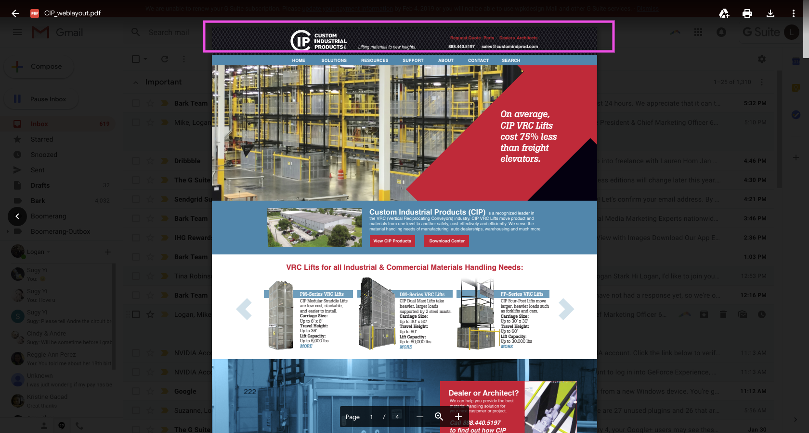

# Custom Industrial Products
## Task: Implement custom header

### Code
#### HTML:
header.php:
```php
<div id="top-header" <?php echo $et_top_info_defined ? '' : 'style="display: none;"' ; ?>>
    <div class="container clearfix">
        <div>
            
        </div>
        <div id="et-secondary-menu">
        <?php 
            if ( ! $et_contact_info_defined && true === $show_header_social_icons ) {
                get_template_part( 'includes/social_icons', 'header' );
            } 
            else if ( $et_contact_info_defined && true === $show_header_social_icons ) {
                ob_start();

                get_template_part( 'includes/social_icons', 'header' );

                $duplicate_social_icons = ob_get_contents();

                ob_end_clean();

                printf(
                '<div class="et_duplicate_social_icons">
                %1$s
                </div>',
                $duplicate_social_icons
                );
            }

            if ( '' !== $et_secondary_nav ) {
                echo $et_secondary_nav;
            }

            et_show_cart_total();
        ?>
        </div> <!-- #et-secondary-menu -->

        <?php if ( $et_contact_info_defined ) : ?>

        <div id="et-info">
            <?php if ( '' !== ( $et_phone_number = et_get_option( 'phone_number' ) ) ) : ?>
            <span id="et-info-phone">
            <?php echo et_sanitize_html_input_text( $et_phone_number ); ?></span>
            <?php endif; ?>

            <?php if ( '' !== ( $et_email = et_get_option( 'header_email' ) ) ) : ?>
            <a href="<?php echo esc_attr( 'mailto:' . $et_email ); ?>"><span id="et-info-email">
            <?php echo esc_html( $et_email ); ?></span></a>
            <?php endif; ?>

            <?php
                if ( true === $show_header_social_icons ) {
                    get_template_part( 'includes/social_icons', 'header' );
                } ?>
        </div> <!-- #et-info -->

        <?php endif; // true === $et_contact_info_defined ?>


    </div> <!-- .container -->
</div> <!-- #top-header -->
```
Guide:
The structure of the top header before was:
```html
<div id="top-header">
    <div class="container clearfix">
        <div id="et-info">...</div>
        <div id="et-secondary-menu">...</div>
    </div>
</div>
```
The CSS basically looked like this:
```css
#et-info {
    float: left;
}
#et-secondary-menu {
    float:right;
}
```
That's why the menu before had the contact info on the left and the red menu on the right. So, first thing is to remove the "float" property. See CSS section. Also, make sure the text align of the container is to the right so that the contact info and secondary menu display on the right side of the top bar. Next, the order of #et-info and #et-secondary-menu is wrong. Without float, the "divs" display one under another, so contact info was on top and secondary menu was under. Switch the order so that the secondary menu is on top. Finally, to add the logo, add an "img" tag above #et-info. The structure of your HTML will now look like this:
```html
<div id="top-header">
    <div class="container clearfix">
        
        <div id="et-secondary-menu">...</div>
        <div id="et-info">...</div>
    </div>
</div>
```
#### CSS:
```css
#top-header .container {
    text-align: right!important; 
}
#et-info {
    float:none!important;
}
#et-secondary-menu {
    float:none!important;
}
```
