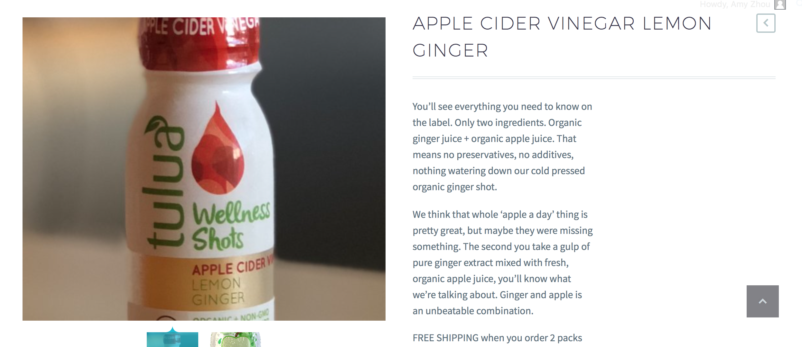
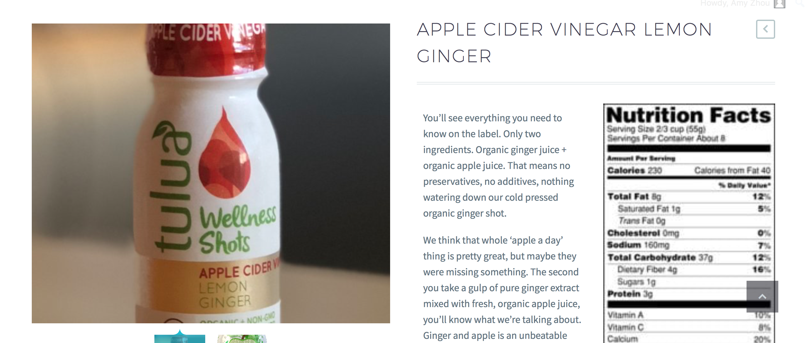
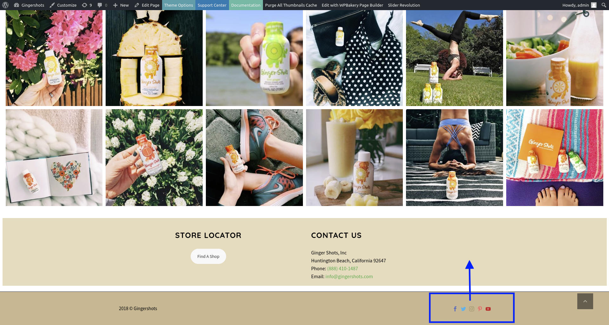
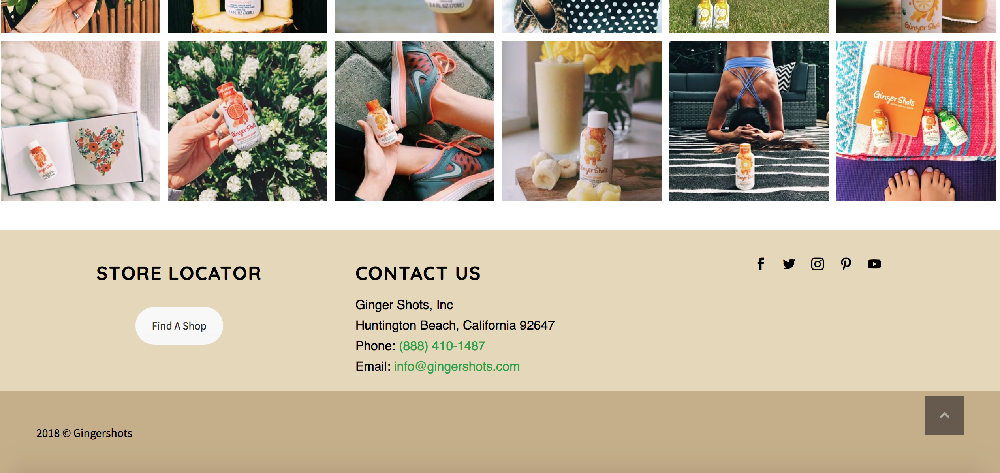
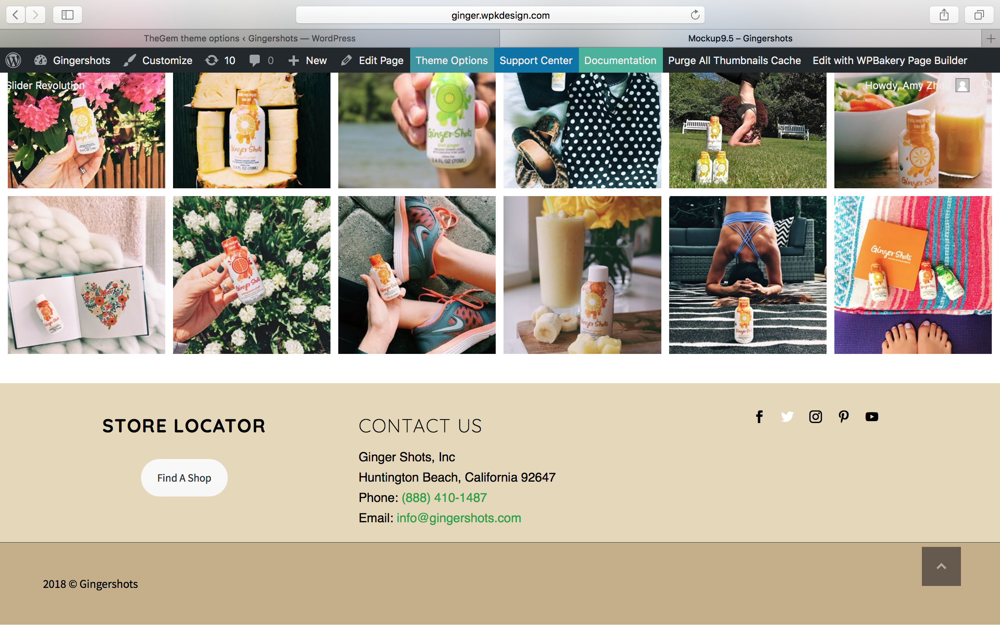
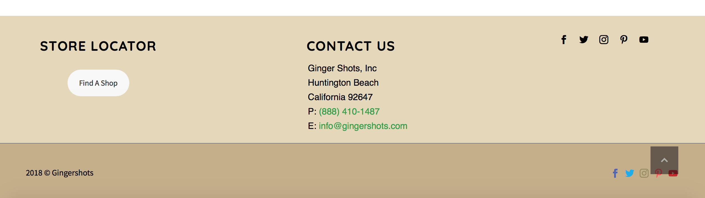
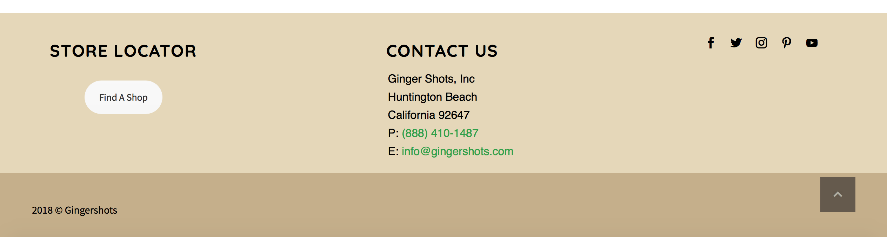
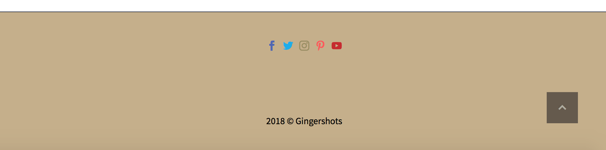
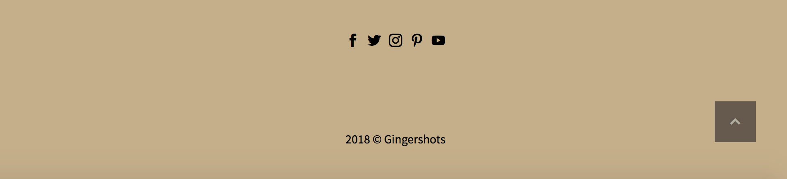

# Gingershots Tasks 
### Not a complete list
1. Product description two columns (left column text, right column nutrition label image)
```html
/* Product description: text in one column, image in other column */
<div style="float:left; width: 48%;padding: 10px">
    You'll see everything you need to know on the label. Only two ingredients. Organic ginger juice + organic apple juice. That means no preservatives, no additives, nothing watering down our cold pressed organic ginger shot.

    We think that whole 'apple a day' thing is pretty great, but maybe they were missing something. The second you take a gulp of pure ginger extract mixed with fresh, organic apple juice, you'll know what we're talking about. Ginger and apple is an unbeatable combination.

    FREE SHIPPING when you order 2 packs (of 6) or more!
</div>

```
Before:

After:

2. Put social icons into footer
Before:

After:

3. Make social icons white when hovered on
```css
/* Social media icons turn white when hovered on*/
.socials-colored-hover a:hover .socials-item-icon.facebook {
    color: #ffffff;
}
.socials-colored-hover a:hover .socials-item-icon.twitter {
    color: #ffffff;
}
.socials-colored-hover a:hover .socials-item-icon.pinterest {
    color: #ffffff;
}
.socials-colored-hover a:hover .socials-item-icon.instagram {
    color: #ffffff;
}
.socials-colored-hover a:hover .socials-item-icon.youtube {
    color: #ffffff;
}
```
Result:

4. Hide social icons only on the homepage
```css
/* Hide social media icons in footer on homepage */
.page-id-26475 #footer-nav .socials-item
{
    visibility: hidden;
}
```
Before:

After:

5. Make social icons black in copyright footer
```css
/* Make social media icons black */
.socials-colored a .socials-item-icon.facebook{
    color: #000000;
}
.socials-colored a .socials-item-icon.twitter{
    color: #000000;
}
.socials-colored a .socials-item-icon.pinterest{
    color: #000000;
}
.socials-colored a .socials-item-icon.instagram{
    color: #000000;
}
.socials-colored a .socials-item-icon.youtube{
    color: #000000;
}
```
Before:

After:

